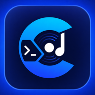
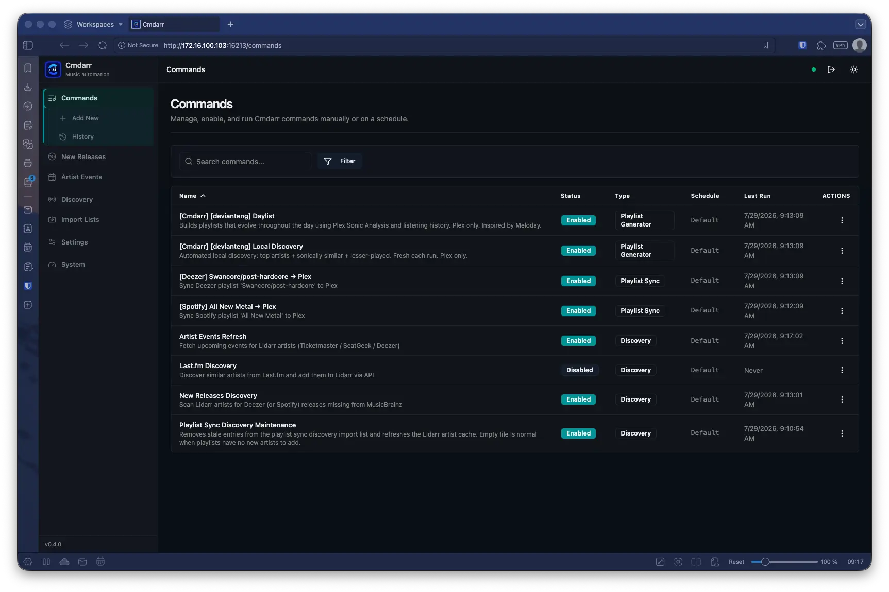
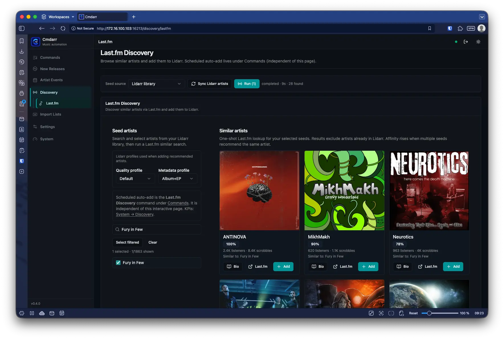
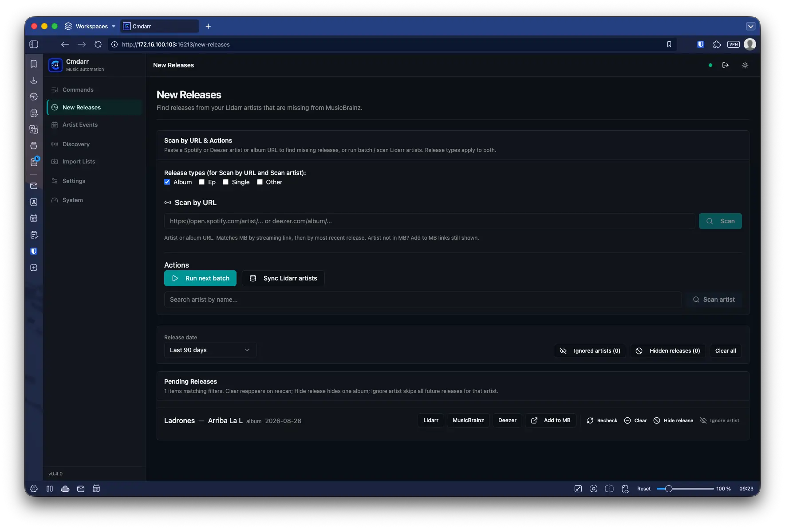
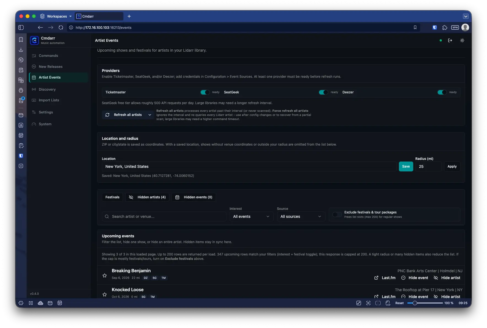
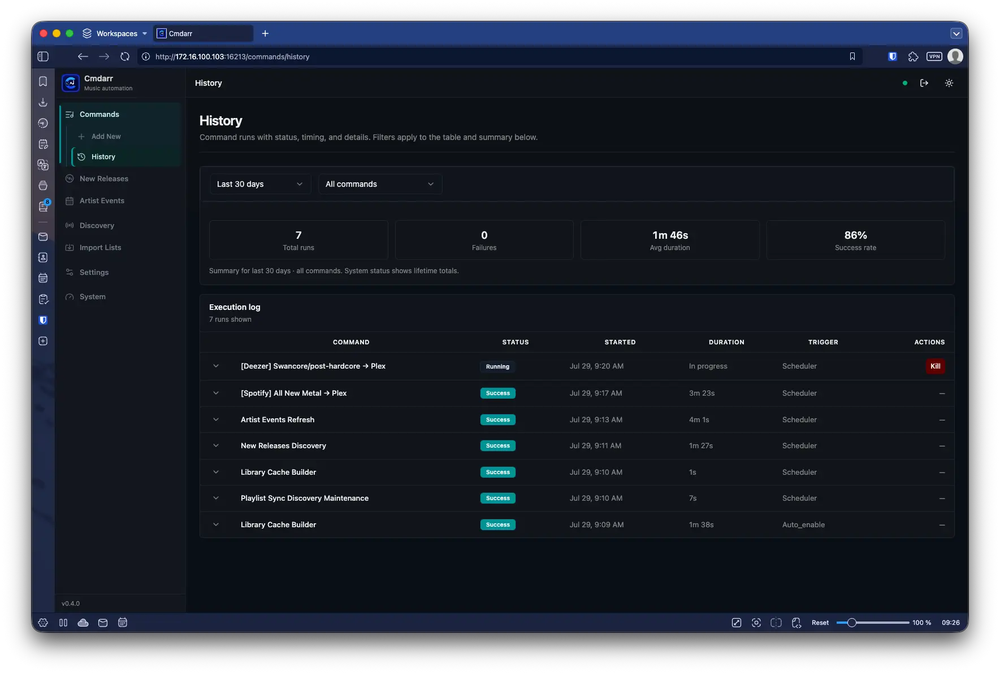
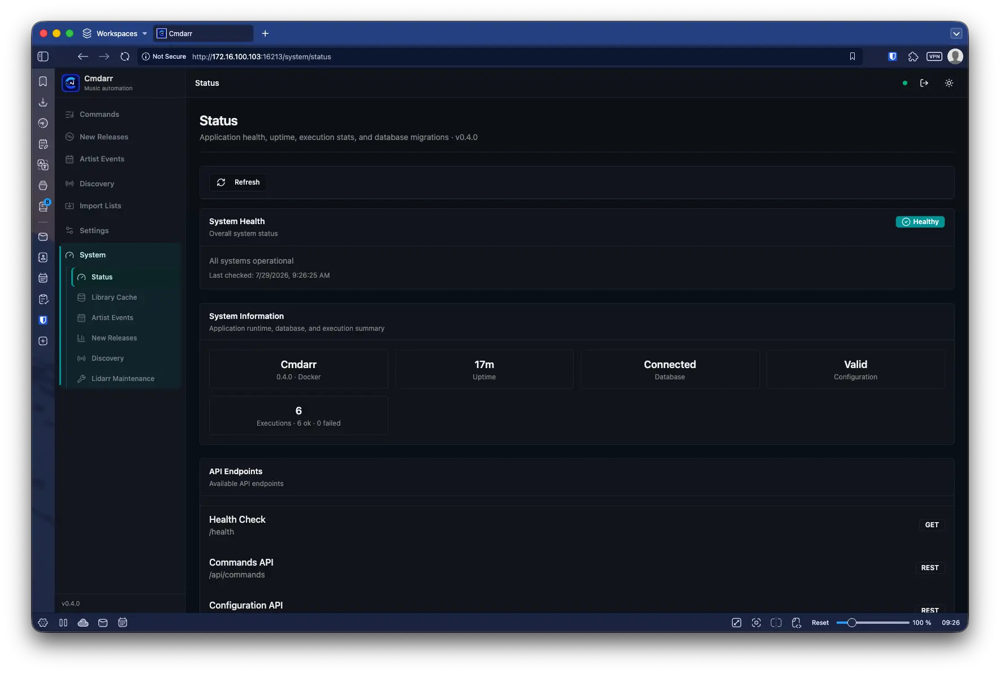

[](https://github.com/DeviantEng/Cmdarr/actions/workflows/pr-checks.yml)
[](https://github.com/DeviantEng/Cmdarr/actions/workflows/docker-publish.yml)
[](https://github.com/DeviantEng/Cmdarr/tags)
[](https://discord.gg/SfD8GVhMzN)

<p align="center">
  
</p>

# Cmdarr

Lidarr grows your music library. Cmdarr is the automation layer around it: discover artists, sync and generate playlists, catch releases missing from MusicBrainz, and surface upcoming shows—wired into Last.fm, ListenBrainz, Spotify, Deezer, Plex, and Jellyfin through a familiar *arr-style UI.

## Quick links

- [Docker image (GHCR)](https://ghcr.io/devianteng/cmdarr)
- [Extended docs](readme-extended.md) (commands, env/settings, troubleshooting)
- [Changelog](CHANGELOG.md)
- [Discord](https://discord.gg/SfD8GVhMzN)

## Who it's for

- You already run **Lidarr** (and ideally **Plex** and/or **Jellyfin**)
- You want discovery, playlists, and events without a pile of one-off scripts
- You prefer Docker / self-hosted ops with a web UI for config and scheduled commands

## Features

- **Music discovery** – Last.fm similar artists (interactive UI + scheduled add to Lidarr), playlist-sync discovery via a Lidarr custom list, new releases from Deezer/Spotify that are missing in MusicBrainz (including scan-by-URL)
- **Playlist sync** – Spotify, Deezer, ListenBrainz curated, and other public sources → Plex and/or Jellyfin, with library caching
- **Playlist generators** – Daylist (time-of-day), Local Discovery, Artist Essentials, Mood (Plex Sonic), **XMPlaylist** (SiriusXM via [xmplaylist.com](https://xmplaylist.com)), **Setlist.fm** (likely setlists for upcoming shows), and more
- **Artist events** – Ticketmaster, SeatGeek, and Deezer feeds for Lidarr artists (`/events`), with distance filter, interested, hides, and multi-provider ticket links
- **Lidarr maintenance** – Trigger Lidarr actions such as Update All (metadata refresh) and Wanted Search (top-X wanted albums) on your schedule
- **Ops** – Commands dashboard + history, web config, system status / library cache, optional auth

## Screenshots

Click a thumbnail to open the full-size image. For a new tab, use **⌘/Ctrl+click** or **middle-click** (GitHub READMEs cannot force `target="_blank"`).

<table>
  <tr>
    <td align="center" width="50%">
      <a href="docs/screenshots/commands.webp?raw=true">
        
      </a><br />
      <em>Commands</em>
    </td>
    <td align="center" width="50%">
      <a href="docs/screenshots/discovery-lastfm.webp?raw=true">
        
      </a><br />
      <em>Last.fm Discovery</em>
    </td>
  </tr>
  <tr>
    <td align="center" width="50%">
      <a href="docs/screenshots/new-releases.webp?raw=true">
        
      </a><br />
      <em>New Releases</em>
    </td>
    <td align="center" width="50%">
      <a href="docs/screenshots/events.webp?raw=true">
        
      </a><br />
      <em>Artist Events</em>
    </td>
  </tr>
  <tr>
    <td align="center" width="50%">
      <a href="docs/screenshots/commands-history.webp?raw=true">
        
      </a><br />
      <em>Command history</em>
    </td>
    <td align="center" width="50%">
      <a href="docs/screenshots/system-status.webp?raw=true">
        
      </a><br />
      <em>System status</em>
    </td>
  </tr>
</table>

## Prerequisites

**Required**

- **Docker** (recommended), or **Python 3.14** + **Node 24** for local development
- **Lidarr** URL + API key
- **Last.fm** API key ([register](https://www.last.fm/api/account/create))

**Optional (by feature)**

| Feature | Needs |
|---------|--------|
| Playlist sync / generators | Plex and/or Jellyfin |
| ListenBrainz curated sync | ListenBrainz token (+ username) |
| Spotify playlists / New Releases | No account required by default (scraper). Optional Client ID/Secret for the official Spotify API |
| New Releases batch scans | MusicBrainz enabled |
| Artist events | Ticketmaster and/or SeatGeek credentials; Deezer optional (ARL) |
| Setlist generator | setlist.fm API key ([register](https://api.setlist.fm/)) |

## Quick Start

### Docker Compose (Recommended)

```yaml
services:
  cmdarr:
    image: ghcr.io/devianteng/cmdarr:latest
    container_name: cmdarr
    ports:
      - "8080:8080"
    # OWASP Docker: limit capabilities, prevent privilege escalation
    cap_drop:
      - ALL
    security_opt:
      - no_new_privileges: true
    volumes:
      - ./cmdarr-data:/app/data
    environment:
      - TZ=America/New_York
      - PUID=1000
      - PGID=1000
      - LIDARR_URL=http://lidarr:8686
      - LIDARR_API_KEY=your_lidarr_api_key
      - LASTFM_API_KEY=your_lastfm_api_key
      # Optional: Plex, Jellyfin, ListenBrainz, Spotify for full features
      - PLEX_URL=http://plex:32400
      - PLEX_TOKEN=your_plex_token
    restart: unless-stopped
    stop_grace_period: 320s
    healthcheck:
      test: ["CMD", "python", "/app/docker/healthcheck.py"]
      interval: 30s
      timeout: 10s
      retries: 3
```

### Docker Run

```bash
docker run -d \
  --name cmdarr \
  -p 8080:8080 \
  -v ./cmdarr-data:/app/data \
  -e TZ=America/New_York \
  -e LIDARR_URL=http://lidarr:8686 \
  -e LIDARR_API_KEY=your_lidarr_api_key \
  -e LASTFM_API_KEY=your_lastfm_api_key \
  --restart unless-stopped \
  ghcr.io/devianteng/cmdarr:latest
```

Open `http://localhost:8080`. On first run, create the admin account if prompted. Confirm **Settings → Music Management** (Lidarr) and **Music Sources** (Last.fm); enable Plex/Jellyfin under **Media Servers** when you want playlists.

### Environment Options

All configuration can be set via environment variables or the web UI. For the full list—including access control (`CMDARR_AUTH_USERNAME`, `CMDARR_AUTH_PASSWORD`, `CMDARR_API_KEY`), optional services, library cache, and scheduler—see [Environment Variables](readme-extended.md#environment-variables) in the extended documentation.

### Local Python Environment

For development or running without Docker:

> **Important:** Build the React frontend before starting. The app will not start without it.
>
> **Requirements:** Python 3.14, Node 24 (see `.python-version` and `.nvmrc`)

```bash
git clone https://github.com/DeviantEng/cmdarr.git
cd cmdarr

python -m venv .venv
source .venv/bin/activate   # Windows: .venv\Scripts\activate

python -m pip install -r requirements.txt
cd frontend && npm install && npm run build && cd ..

export LIDARR_URL=http://localhost:8686
export LIDARR_API_KEY=your_lidarr_api_key
export LASTFM_API_KEY=your_lastfm_api_key

python run_fastapi.py
```

Visit `http://localhost:8080`. For frontend dev with hot reload: `npm run dev` in `frontend/` and use `http://localhost:5173`.

## Web Interface

Access `http://localhost:8080` for:

- **Commands** – Dashboard, enable/disable, manual run, history; create generators and playlist sync via Add New
- **Discovery** – Interactive Last.fm similar-artist discovery (`/discovery/lastfm`)
- **New Releases** – Deezer/Spotify releases missing from MusicBrainz; scan artist by URL
- **Artist Events** – Upcoming shows for Lidarr artists
- **Settings / System** – Web config, health, library cache, Lidarr maintenance KPIs

## Lidarr Integration

Add Cmdarr as a Custom List in Lidarr (Settings → Import Lists) for playlist sync discovery:

- `http://cmdarr:8080/import_lists/discovery_playlistsync` – playlist sync artists

Last.fm Discovery adds artists directly to Lidarr via API (interactive page or scheduled command); do not configure a Last.fm import list.

## Documentation

- **[readme-extended.md](readme-extended.md)** – command details, env reference, architecture, troubleshooting
- **[CHANGELOG.md](CHANGELOG.md)** – release history
- **[Discord](https://discord.gg/SfD8GVhMzN)** – community

## Contributing

Cmdarr is designed to be extended. The modular architecture makes it straightforward to add new commands for different music services and automation tasks.

## License

MIT License – See LICENSE file for details

---

*Because sometimes the best solutions are the ones that execute reliably, even if the code looks questionable.*
