# Cmdarr – Extended Documentation

This document covers architecture, command details, configuration reference, and troubleshooting. For a quick overview and getting started, see [README.md](README.md).

---

## Development Flow

This section describes the branching model, workflow, and quality gates for Cmdarr. AI agents and developers should follow this process.

### Branch Model

- **main** – Production; protected; only updated via PR from release branches
- **develop** – Integration branch; feature/fix branches merge here freely
- **feature/\*** – New features (e.g. `feature/daylist`)
- **fix/\*** – Bug fixes (e.g. `fix/0.3.6-release`)
- **release/\*** – Release preparation; created from develop, PR'd to main

### Workflow

```mermaid
flowchart LR
    subgraph dev [Development]
        F[feature/fix branch] --> M[merge to develop]
        M --> T1[test]
        T1 --> R[run make check]
        R --> FIX[fix issues]
        FIX --> T2[push to develop]
        T2 --> T3[test]
    end

    subgraph release [Release]
        T3 --> RB[release branch]
        RB --> MR[merge to develop]
        MR --> TRIVY[develop build + Trivy]
        TRIVY --> VALID[validate pass]
        VALID --> TAG[tag]
        TAG --> PR[PR to main]
        PR --> GATE[gate checks]
        GATE --> APPROVE[approve if clean]
        APPROVE --> MERGE[merge]
        MERGE --> BUILD[CI builds prod image]
        BUILD --> SYNC[push main to develop]
    end
```



1. Create feature/fix branch from develop
2. Work, test, run `make check`; fix any issues with `make fix` or manual changes
3. Merge to develop (no PR required for solo development)
4. Test on develop
5. When ready to release: create release branch from develop
6. **Merge release branch into develop first** (not main yet)
7. Let develop image build and **validate Trivy scan passes**
8. When develop build is green: create tag, open PR from release to main
9. Gate runs on PR to main; all checks must pass
10. Approve and merge; CI builds prod image; push main back to develop

Main should only receive changes that have been validated on develop (including Trivy).

### Dev-Time Commands

| Command | Purpose |
|---------|---------|
| `make check` | Run all gate checks (mirrors CI); no auto-fix |
| `make fix` | Auto-fix high-confidence issues (formatting, safe lint fixes); review diff before commit |

Run `make check` before pushing to develop or opening a PR to main. Use `make fix` to auto-fix; manually fix anything that remains.

### Gate Check Specification

The PR gate runs on `pull_request` to `main` only. All jobs must pass. No gates on develop or commits.

| Job | Working dir | Command | Fail if |
|-----|-------------|---------|---------|
| ruff | repo root | `ruff check . && ruff format --check .` | exit code != 0 |
| frontend-lint | frontend | `npm ci && npm run lint` | exit code != 0 |
| frontend-format | frontend | `npm run format:check` | exit code != 0 |
| npm-audit | frontend | `npm ci && npm audit --audit-level=high` | vulnerabilities found |
| pip-audit | repo root | `pip install pip-audit && pip-audit` | vulnerabilities found |

CodeQL runs independently (already configured in the repo).

### Docker Build Pipeline

When the Docker image is built (push to main or develop), Trivy scans the image before push:

- **Fail** on CRITICAL or HIGH vulnerabilities
- **Report** in Action run summary (table format)

The job fails if CRITICAL/HIGH are found; the image is not pushed until the scan passes.

### Best Practices

- No auto-fix at the gate; all fixes must be committed before the PR
- Run `make check` locally before opening a PR to main
- Fix issues in development; the gate is the final verification

---

## Available Commands

### Discovery Commands

#### `discovery_lastfm`
**What it does**: Discovers similar artists by querying Last.fm for each artist in your Lidarr library  
**Benefits**:
- Uses MusicBrainz fuzzy matching as fallback for artists missing MBIDs
- Intelligent caching with 7-day TTL for optimal performance
- Real-time filtering against current Lidarr library state
- Comprehensive deduplication and quality-based output limiting
- Generates JSON import list for Lidarr integration

**Configuration**:
- `DISCOVERY_LASTFM_ENABLED=true`
- `DISCOVERY_LASTFM_SCHEDULE_HOURS=24`
- `DISCOVERY_LASTFM_LIMIT=5`

#### `playlist_sync_discovery_maintenance`
**What it does**: Maintains the unified discovery import list by removing stale entries  
**Benefits**:
- Automatically cleans up old discovery entries based on configurable age threshold
- Prevents import list bloat and improves Lidarr performance
- Runs automatically as a scheduled maintenance task

### New Releases Discovery

**What it does**: Scans your Lidarr artists for releases on Deezer (or Spotify) that are missing from MusicBrainz  
**Access**: Web UI → New Releases (`/new-releases`)

**Benefits**:
- **Deezer (default)**: No account required—uses public API; ideal without Spotify Premium
- **Spotify (optional)**: Set credentials in Config; uses Lidarr Spotify links when available

- Uses Lidarr artist links when available (avoids name collisions like Emmure vs emmurée)
- 1 MusicBrainz API call per artist (release groups), no per-album lookups
- Filters out live recordings, compilations, and guest appearances
- One-click links to Lidarr, MusicBrainz artist page, or Harmony to add the album
- **Scan Artist by URL**: Artist not in Lidarr yet? Paste a Spotify or Deezer artist URL to fetch all albums, compare to MusicBrainz, and get a list of missing releases with Harmony links; add each in Harmony, then add the artist to Lidarr after ~24h

**Requirements**: Lidarr; either Deezer (default) or Spotify credentials in Config  
**Configuration**: Release source in Commands → Edit; `NEW_RELEASES_CACHE_DAYS` (default 14) in Configuration → Music Sources

### Playlist Generators (Plex/Jellyfin)

Create via Commands → New. All use `[Cmdarr]` prefix; display name syncs with playlist.

- **Daylist** – Time-of-day playlists from Plex Sonic Analysis and listening history; configurable periods (dawn, morning, afternoon, etc.)
- **Local Discovery** – Top artists from play history + sonically similar tracks; single instance; 90-day lookback default
- **Artist Essentials** – Top X tracks per artist from a list; auto-naming or custom name
- **Mood Playlist** – Selected Plex Sonic moods; multi-mood scoring; optional year filter

### Playlist Sync Commands

#### Dynamic Playlist Sync Commands
**What it does**: Create unlimited playlist sync commands through the web interface  
**Benefits**:
- **ListenBrainz Curated Playlists**: Sync Weekly Exploration, Weekly Jams, Daily Jams
- **External Playlist Support**: Sync **public** playlists from Spotify, Deezer, and other sources
- **Multi-Target Support**: Sync to Plex, Jellyfin, or both simultaneously
- **Library Cache Optimization**: 3+ minutes → 30 seconds sync time
- **Smart Playlist Management**: Automatic cleanup, retention policies, and duplicate prevention
- **Direct Lidarr Integration**: Artists from playlists are automatically added to Lidarr for monitoring

**Configuration**: Create and manage playlist sync commands through the web interface under Commands → New...

---

## Library Cache Optimization

Cmdarr includes an advanced library caching system that dramatically improves playlist sync performance:

### **Performance Benefits**
- **3+ minutes → 30 seconds** playlist sync time
- **400+ API calls → 1 initial library fetch** per batch
- **No timeouts** from excessive API usage
- **~50MB memory usage** during operations (cleared after)

### **How It Works**
The library cache system fetches your complete music library once and stores it with optimized search indexes:

```
Traditional Approach:  50 tracks × 8 searches each = 400+ API calls = 3+ minutes + timeouts
With Library Cache:    1 library fetch + instant memory searches = ~30 seconds
```

### **Smart Features**
- **SQLite Persistence**: 30-day cache with automatic expiration
- **Memory Optimization**: Loads only during active playlist operations
- **Automatic Refresh**: Detects stale data and rebuilds cache when needed
- **Configurable Limits**: Memory usage limits with graceful fallback
- **Multi-Client Support**: Plex and Jellyfin support with extensible architecture
- **Manual Cache Refresh**: UI buttons for on-demand cache rebuilding
- **Cache Status Monitoring**: Real-time cache health and performance metrics

---

## Configuration Reference

### Required API Keys

- **Lidarr API Key**: Found in Lidarr Settings → General → Security
- **Last.fm API Key**: Register at [Last.fm API](https://www.last.fm/api/account/create)
- **ListenBrainz Token**: Get from [ListenBrainz Profile](https://listenbrainz.org/profile/) (for playlist features)
- **Plex Token**: Get from [Plex Support Guide](https://support.plex.tv/articles/204059436/) (for playlist sync)
- **Jellyfin Token**: Get from [Jellyfin API Documentation](https://jellyfin.org/docs/general/administration/access-tokens/) (for playlist sync)
- **Jellyfin User ID**: Found in Jellyfin Dashboard → Users → Select User → User ID
- **Spotify Client ID & Secret**: Get from [Spotify Developer Dashboard](https://developer.spotify.com/dashboard) (for playlist sync, public playlists only)

### Lidarr Integration

Add Cmdarr as a Custom List in Lidarr:
1. Go to Settings → Import Lists
2. Add a new "Custom List" 
3. Set URL to: `http://cmdarr:8080/import_lists/discovery_lastfm` or `http://cmdarr:8080/import_lists/discovery_playlistsync`
4. Configure sync interval as desired (recommend 24-48 hours)

### Environment Variables

All configuration can be set via environment variables. See Config in the web UI for the full list.

#### Access Control (Single-User Auth)

First run prompts for username and password. These env vars **overwrite** the database (useful for Docker secrets or password reset):

| Variable | Description |
|----------|-------------|
| `CMDARR_AUTH_USERNAME` | Admin username |
| `CMDARR_AUTH_PASSWORD` | Admin password (plain text; hashed on write) |
| `CMDARR_API_KEY` | API key for external calls (e.g. `X-API-Key` header, `Authorization: Bearer`) |

**API key:** Generate and rotate from Config → Access Control in the UI. Use `CMDARR_API_KEY` only when you need to set it via env (e.g. Docker secrets); the UI is simpler for normal use.

#### Full Reference

```bash
# Access control (overwrites DB; first run or password reset)
CMDARR_AUTH_USERNAME=admin
CMDARR_AUTH_PASSWORD=your_password
CMDARR_API_KEY=your_api_key_for_external_calls

# Required API Configuration
LIDARR_URL=http://lidarr:8686
LIDARR_API_KEY=your_lidarr_api_key
LASTFM_API_KEY=your_lastfm_api_key

# Optional Services
PLEX_CLIENT_ENABLED=true
PLEX_URL=http://plex:32400
PLEX_TOKEN=your_plex_token
PLEX_LIBRARY_NAME=Music
JELLYFIN_CLIENT_ENABLED=false
JELLYFIN_URL=http://jellyfin:8096
JELLYFIN_TOKEN=your_jellyfin_token
JELLYFIN_USER_ID=your_jellyfin_user_id
LISTENBRAINZ_TOKEN=your_listenbrainz_token
LISTENBRAINZ_USERNAME=your_username
SPOTIFY_CLIENT_ID=your_spotify_client_id
SPOTIFY_CLIENT_SECRET=your_spotify_client_secret

# MusicBrainz (New Releases Discovery)
MUSICBRAINZ_ENABLED=true
NEW_RELEASES_CACHE_DAYS=14

# Library cache optimization
LIBRARY_CACHE_PLEX_TTL_DAYS=30
LIBRARY_CACHE_MEMORY_LIMIT_MB=512
LIBRARY_CACHE_PLEX_ENABLED=true
LIBRARY_CACHE_JELLYFIN_ENABLED=true

# Scheduler (cron-based; TZ also used for schedule interpretation)
DEFAULT_SCHEDULE_CRON="0 3 * * *"
SCHEDULER_TIMEZONE=America/New_York
MAX_PARALLEL_COMMANDS=1

# Restart retry: auto-retry commands interrupted by restart (default: true)
RESTART_RETRY_ENABLED=true

# Graceful shutdown (wait for running commands before exit)
SHUTDOWN_GRACEFUL_TIMEOUT_SECONDS=300

# Rate limiting
LASTFM_RATE_LIMIT=8.0
MUSICBRAINZ_RATE_LIMIT=1.5
MUSICBRAINZ_MAX_RETRIES=3
MUSICBRAINZ_RETRY_DELAY=2.0

# Web Server
WEB_HOST=0.0.0.0
WEB_PORT=8080

# Logging
LOG_LEVEL=INFO
LOG_RETENTION_DAYS=7
```

---

## Troubleshooting

### Common Issues

**No artists discovered**: Check Lidarr connectivity and API key
```bash
docker logs cmdarr | grep -i "lidarr"
```

**Playlist sync timeouts**: Enable library cache optimization.
```bash
# Check if library cache is enabled
curl http://localhost:8080/api/config/ | grep -i "library_cache"

# Monitor library cache performance
docker logs cmdarr | grep -i "cache"

# Manual cache refresh via UI or API
curl -X POST http://localhost:8080/api/commands/library_cache_builder/execute \
  -H "Content-Type: application/json" \
  -d '{"target": "plex", "force_refresh": true}'
```

**Configuration not loading**: Check environment variables and web interface
```bash
curl http://localhost:8080/api/config/
```

**"Command was running when application restarted"**: Commands (e.g. playlist syncs) were interrupted by a restart. Cmdarr handles this by:
- **Restart retry**: On next startup, interrupted commands are automatically re-queued and run as soon as possible (configurable via `RESTART_RETRY_ENABLED`)
- **Graceful shutdown** (optional): Add `stop_grace_period: 320s` to docker-compose so Docker waits for running commands to finish before SIGKILL

### Performance Monitoring
Monitor command execution and web server performance:
- **Health endpoint**: `http://localhost:8080/health`
- **Status dashboard**: `http://localhost:8080/status`
- **Container stats**: `docker stats cmdarr`
- **Library cache stats**: Check status dashboard for cache hit rates and memory usage
- **Execution tracking**: See whether commands were triggered manually or by scheduler
- **Rate limit monitoring**: Check logs for API rate limit handling and retry attempts

---

## Technical Architecture

### Architecture Overview

Cmdarr uses a modern FastAPI-based architecture with SQLAlchemy ORM:

```
cmdarr/
├── run_fastapi.py          # FastAPI application entry point
├── app/                    # FastAPI application
│   ├── main.py            # Main FastAPI app with routes
│   └── api/               # API endpoints
│       ├── config.py      # Configuration management API
│       ├── commands.py    # Command management API
│       ├── new_releases.py # New Releases Discovery API
│       ├── status.py      # Status and health API
│       └── import_lists.py # Import list serving API
├── frontend/               # React/Vite web UI (primary)
│   ├── src/
│   │   ├── pages/         # Commands, Config, Status, New Releases, Import Lists
│   │   ├── components/    # UI components (shadcn-style)
│   │   └── lib/           # API client, types, theme
│   └── dist/              # Built assets (served by FastAPI)
├── database/              # Database layer
│   ├── models.py          # SQLAlchemy models
│   ├── config_models.py   # Command config, new releases, scan logs
│   ├── database.py        # Database connection management
│   └── init_commands.py   # Default command initialization
├── services/              # Business logic services
│   ├── config_service.py  # Configuration management
│   └── command_executor.py # Command execution service
├── cache_manager.py       # SQLAlchemy-based API response caching
├── utils/                 # Shared utilities and common functionality
│   ├── logger.py          # Centralized logging with rotation
│   ├── library_cache_manager.py  # Library cache optimization system
│   ├── status_tracker.py  # Application status monitoring
│   ├── discovery.py       # Discovery utilities and filtering
│   └── http_client.py     # Common HTTP client utilities
├── commands/              # Modular command system
│   ├── command_base.py    # Abstract base class
│   ├── config_adapter.py  # Configuration adapter for commands
│   ├── discovery_lastfm.py
│   ├── new_releases_discovery.py
│   ├── playlist_sync_discovery_maintenance.py
│   ├── playlist_sync.py   # Dynamic playlist sync
│   └── library_cache_builder.py
├── clients/               # Service API clients with shared base class
│   ├── client_base.py     # Base class with common functionality
│   ├── client_lidarr.py
│   ├── client_lastfm.py
│   ├── client_listenbrainz.py
│   ├── client_musicbrainz.py
│   ├── client_spotify.py  # Spotify API (playlist sync, new releases)
│   ├── client_plex.py     # Enhanced with library cache support
│   └── client_jellyfin.py # Jellyfin API client with playlist support
```

### Modern Architecture Features
- **FastAPI**: High-performance async web framework
- **SQLAlchemy ORM**: Database abstraction with SQLite backend
- **React + Vite + TypeScript**: Primary web UI; built to `frontend/dist`, served by FastAPI
- **Tailwind CSS**: Utility-first CSS framework; Radix UI primitives for components
- **Thread-Pool Execution**: Commands run in isolation without blocking the web server
- **Database-Driven Config**: All configuration stored in SQLite with environment variable override
- **RESTful APIs**: Clean API design for all functionality

### Library Cache Architecture
- **LibraryCacheManager**: Centralized cache orchestrator
- **Client Integration**: Music clients implement cache interface
- **Memory Management**: Smart loading with configurable limits
- **Multi-Service**: Plex and Jellyfin support with extensible architecture
- **Helper Commands**: Separate cache building from playlist operations
- **Manual Refresh**: UI controls for on-demand cache rebuilding

### Data Flow

#### Similar Artist Discovery
```
Lidarr Artists → Last.fm Similar Artists → MusicBrainz Fuzzy Match → SQLite Cache → Output Limiting → Lidarr Import JSON
```

#### ListenBrainz Discovery
```
ListenBrainz Weekly Playlist → Extract Artists → Filter Against Lidarr → MusicBrainz Lookup → Lidarr Import JSON
```

#### Playlist Sync (Optimized)
```
ListenBrainz Curated Playlists → Extract Tracks → Library Cache Lookup → Create/Update Playlists → Smart Naming → Retention Cleanup
```

#### Library Cache Building
```
Scheduled/Manual Trigger → Fetch Complete Library → Build Search Indexes → Store in SQLite → Memory Cache → Performance Optimization
```

Cmdarr maintains high success rates through multi-service fallback strategies, comprehensive caching (70-90% API reduction), intelligent retry logic with exponential backoff, and quality-based filtering for optimal library expansion. The library cache system provides additional 6x performance improvements for playlist operations.

### Docker Configuration

#### User Permissions
Use `PUID` and `PGID` environment variables to match your host user:
```bash
# Find your user/group IDs
id

# Set in docker-compose.yml or docker run
PUID=1001
PGID=1001
```

#### Available Tags
- `ghcr.io/devianteng/cmdarr:latest` - Stable releases
- `ghcr.io/devianteng/cmdarr:develop` - Bleeding edge development builds

### Logging

Cmdarr implements professional log management:

- **Daily rotation**: Logs rotate automatically at midnight
- **Configurable retention**: Keep N days of logs (default 7)
- **File structure**: `cmdarr.log` (current) + `cmdarr.log-YYYYMMDD` (rotated)
- **Component logging**: Each service has its own logger namespace
- **Automatic cleanup**: Old logs removed based on retention policy
- **Smart filtering**: Health check requests logged at DEBUG level

Configure logging via environment variables:
```bash
LOG_LEVEL=INFO
LOG_RETENTION_DAYS=7
```

### Volume Mounts

Mount `/app/data` to persist:
- **Database**: `cmdarr.db` (SQLite database with all data)
- **Import Lists**: `import_lists/discovery_lastfm.json`, `import_lists/discovery_playlistsync.json`
- **Logs**: `logs/cmdarr.log` and rotated files

### Manual Commands

While designed for Docker automation, individual commands can be triggered through the web interface or API:

```bash
# Execute commands via API
curl -X POST http://localhost:8080/api/commands/discovery_lastfm/execute
curl -X POST http://localhost:8080/api/commands/new_releases_discovery/execute

# Check configuration and status
curl http://localhost:8080/api/config/
curl http://localhost:8080/api/status/

# View logs
docker logs cmdarr --tail 50
```

### API Endpoints
- **Import Lists**: 
  - `/import_lists/discovery_lastfm` - JSON endpoint for Lidarr similar artist imports
  - `/import_lists/discovery_playlistsync` - JSON endpoint for playlist sync discovered artists
  - `/import_lists/metrics` - Metrics for import list files
- **New Releases**: `/api/new-releases/` - Pending releases, dismiss, recheck, run-batch, scan-artist, lidarr-artists, sync, command-status, dismissed, restore
- **Health Check**: `/health` - Service health status (200/503) for Docker health checks
- **Configuration API**: `/api/config/` - RESTful configuration management
- **Commands API**: `/api/commands/` - Command management and execution

### Debug Mode
Set log level to DEBUG via environment variable:
```bash
LOG_LEVEL=DEBUG
```
