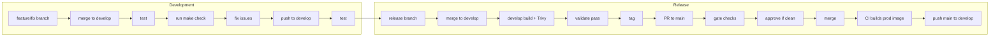

# Cmdarr – Extended Documentation

This document covers architecture, command details, configuration reference, and troubleshooting. For a quick overview and getting started, see [README.md](README.md).

---

## Development Flow

This section describes the branching model, workflow, and quality gates for Cmdarr. AI agents and developers should follow this process.

### Branch Model

- **main** – Production; protected; only updated via PR from release branches
- **develop** – Integration branch; feature/fix branches merge here freely
- **feature/\*** – New features (e.g. `feature/daylist`)
- **fix/\*** – Bug fixes (e.g. `fix/0.3.6-release`)
- **release/\*** – Release preparation; created from develop, PR'd to main

### Workflow


```mermaid
flowchart LR
    subgraph dev [Development]
        F[feature/fix branch] --> M[merge to develop]
        M --> T1[test]
        T1 --> R[run make check]
        R --> FIX[fix issues]
        FIX --> T2[push to develop]
        T2 --> T3[test]
    end

    subgraph release [Release]
        T3 --> RB[release branch]
        RB --> MR[merge to develop]
        MR --> TRIVY[develop build + Trivy]
        TRIVY --> VALID[validate pass]
        VALID --> TAG[tag]
        TAG --> PR[PR to main]
        PR --> GATE[gate checks]
        GATE --> APPROVE[approve if clean]
        APPROVE --> MERGE[merge]
        MERGE --> BUILD[CI builds prod image]
        BUILD --> SYNC[push main to develop]
    end
```

1. Create feature/fix branch from develop
2. Work, test, run `make check`; fix any issues with `make fix` or manual changes
3. Merge to develop (no PR required for solo development)
4. Test on develop
5. When ready to release: create release branch from develop
6. **Merge release branch into develop first** (not main yet)
7. Let develop image build and **validate Trivy scan passes**
8. When develop build is green: create tag (message optional), open PR from release to main. After merge, CI posts release notes to Discord `#releases` from the matching section in [CHANGELOG.md](CHANGELOG.md).
9. Gate runs on PR to main; all checks must pass
10. Approve and merge; CI builds prod image; push main back to develop

Main should only receive changes that have been validated on develop (including Trivy).

### Dev-Time Commands

| Command | Purpose |
|---------|---------|
| `make check` | Run all gate checks (mirrors CI); no auto-fix |
| `make fix` | Auto-fix high-confidence issues (formatting, safe lint fixes); review diff before commit |

Run `make check` before pushing to develop or opening a PR to main. Use `make fix` to auto-fix; manually fix anything that remains.

### Gate Check Specification

The PR gate runs on `pull_request` to `main` only. All jobs must pass. No gates on develop or commits.

| Job | Working dir | Command | Fail if |
|-----|-------------|---------|---------|
| ruff | repo root | `ruff check . && ruff format --check .` | exit code != 0 |
| frontend-lint | frontend | `npm ci && npm run lint` | exit code != 0 |
| frontend-format | frontend | `npm run format:check` | exit code != 0 |
| npm-audit | frontend | `npm ci && npm audit --audit-level=high` | vulnerabilities found |
| pip-audit | repo root | `pip install pip-audit && pip-audit` | vulnerabilities found |

CodeQL runs independently (already configured in the repo).

### Docker Build Pipeline

When the Docker image is built (push to main or develop), Trivy scans the image before push:

- **Fail** on CRITICAL or HIGH vulnerabilities
- **Report** in Action run summary (table format)

The job fails if CRITICAL/HIGH are found; the image is not pushed until the scan passes.

### Best Practices

- No auto-fix at the gate; all fixes must be committed before the PR
- Run `make check` locally before opening a PR to main
- Fix issues in development; the gate is the final verification

---

## Available Commands

### Discovery Commands

#### `discovery_lastfm`
**What it does**: Samples Lidarr artists, finds similar artists via Last.fm (MusicBrainz fallback), and **adds them to Lidarr via API**  
**Benefits**:
- Interactive companion UI at `/discovery/lastfm` (manual seed selection; independent of command enablement)
- Uses MusicBrainz fuzzy matching as fallback for artists missing MBIDs
- Intelligent caching with 7-day TTL for optimal performance
- Real-time filtering against current Lidarr library state and Import List Exclusions
- Requires explicit Lidarr quality + metadata profiles before enable; optional search-for-missing on add
- Cooldown / recent-add state under `data/discovery/` (not an import list)

**Configuration** (Commands → Edit Last.fm Discovery):
- `artists_to_query`, `similar_per_artist`, `artist_cooldown_days`, `limit`, `min_match_score`
- `quality_profile_id`, `metadata_profile_id` (required to enable)
- `search_for_missing_albums` (default false)

#### `playlist_sync_discovery_maintenance`
**What it does**: Maintains the unified discovery import list by removing stale entries  
**Benefits**:
- Automatically cleans up old discovery entries based on configurable age threshold
- Prevents import list bloat and improves Lidarr performance
- Runs automatically as a scheduled maintenance task

### New Releases Discovery

**What it does**: Scans your Lidarr artists for releases on Deezer (or Spotify) that are missing from MusicBrainz  
**Access**: Web UI → New Releases (`/new-releases`)

**Benefits**:
- **Deezer (default)**: Uses open API; no account required
- **Spotify (optional)**: Defaults to spotifyscraper (no account required). When valid Spotify Client ID/Secret are configured and the API works, the official API is used instead—useful when Deezer attaches wrong albums to an artist page (catalog pollution)

- Uses Lidarr artist links when available (avoids name collisions like Emmure vs emmurée)
- 1 MusicBrainz API call per artist (release groups), no per-album lookups
- Filters out live recordings, compilations, and guest appearances
- One-click links to Lidarr, MusicBrainz artist page, or Harmony to add the album
- **Scan Artist by URL**: Artist not in Lidarr yet? Paste a Spotify or Deezer artist URL to fetch all albums, compare to MusicBrainz, and get a list of missing releases with Harmony links; add each in Harmony, then add the artist to Lidarr after ~24h

**Requirements**: Lidarr; MusicBrainz enabled for batch scans  
**Configuration**: Release source (Deezer or Spotify) in Commands → Edit; optional Spotify Client ID/Secret in Configuration → Music Sources; `NEW_RELEASES_CACHE_DAYS` (default 14)

**Note**: Older configs may store `spotify_scraper` as the release source; it is treated as Spotify automatically.

### Playlist Generators (Plex/Jellyfin)

Create via Commands → New. All use `[Cmdarr]` prefix; display name syncs with playlist.

- **Daylist** – Time-of-day playlists from Plex Sonic Analysis and listening history; configurable periods (dawn, morning, afternoon, etc.)
- **Local Discovery** – Top artists from play history + sonically similar tracks; single instance; 90-day lookback default
- **Artist Essentials** – Top X tracks per artist from a list; auto-naming or custom name
- **Mood Playlist** – Selected Plex Sonic moods; multi-mood scoring; optional year filter
- **XMPlaylist** – Newest or most-played tracks from a SiriusXM station via [xmplaylist.com](https://xmplaylist.com) → Plex or Jellyfin
- **Setlist.fm** – Build a playlist of likely live tracks for selected artists (requires `SETLIST_FM_API_KEY` in Config → Music Sources)

### Lidarr Maintenance

Create via Commands → Add New (singleton types). Tracked under **System → Lidarr Maintenance**.

- **Update All** – Queue a Lidarr library metadata refresh (`Lidarr Maintenance - Artist Refresh`)
- **Wanted Search** – Search top-X Wanted albums with Album/EP/Single filters, sort options, and temporary cooldown for grabs / empty results (`Lidarr Maintenance - Missing Search`)

### Playlist Sync Commands

#### Dynamic Playlist Sync Commands
**What it does**: Create unlimited playlist sync commands through the web interface  
**Benefits**:
- **ListenBrainz Curated Playlists**: Sync Weekly Exploration, Weekly Jams, Daily Jams
- **External Playlist Support**: Sync **public** playlists from Spotify, Deezer, and other sources
- **Multi-Target Support**: Sync to Plex, Jellyfin, or both simultaneously
- **Library Cache Optimization**: 3+ minutes → 30 seconds sync time
- **Smart Playlist Management**: Automatic cleanup, retention policies, and duplicate prevention
- **Direct Lidarr Integration**: Artists from playlists are automatically added to Lidarr for monitoring

**Configuration**: Create and manage playlist sync commands through the web interface under Commands → New...

---

## Library Cache Optimization

Cmdarr includes an advanced library caching system that dramatically improves playlist sync performance:

### **Performance Benefits**
- **3+ minutes → 30 seconds** playlist sync time
- **400+ API calls → 1 initial library fetch** per batch
- **No timeouts** from excessive API usage
- **~50MB memory usage** during operations (cleared after)

### **How It Works**
The library cache system fetches your complete music library once and stores it with optimized search indexes:

```
Traditional Approach:  50 tracks × 8 searches each = 400+ API calls = 3+ minutes + timeouts
With Library Cache:    1 library fetch + instant memory searches = ~30 seconds
```

### **Smart Features**
- **SQLite Persistence**: 30-day cache with automatic expiration
- **Memory Optimization**: Loads only during active playlist operations
- **Automatic Refresh**: Detects stale data and rebuilds cache when needed
- **Configurable Limits**: Memory usage limits with graceful fallback
- **Multi-Client Support**: Plex and Jellyfin support with extensible architecture
- **Manual Cache Refresh**: UI buttons for on-demand cache rebuilding
- **Cache Status Monitoring**: Real-time cache health and performance metrics

---

## Configuration Reference

Priority for most settings: **environment variables > database (Settings UI) > defaults**.  
Exception: `CMDARR_USER_AGENT` is **Settings UI / DB only** (not overridable via env).

`WEB_HOST` / `WEB_PORT` are also read from the environment at process start for the uvicorn bind address.

### Credentials and where to get them

**Required for core use**

- **Lidarr** URL + API key — Lidarr → Settings → General → Security
- **Last.fm** API key — [Last.fm API account](https://www.last.fm/api/account/create)

**Optional by feature**

- **Plex** token — [Plex support guide](https://support.plex.tv/articles/204059436/); enable the Plex client in Settings → Media Servers
- **Jellyfin** token + user ID — [Jellyfin access tokens](https://jellyfin.org/docs/general/administration/access-tokens/); Dashboard → Users → User ID
- **ListenBrainz** token (+ username) — [ListenBrainz profile](https://listenbrainz.org/profile/)
- **Spotify** Client ID/Secret — optional; [Developer Dashboard](https://developer.spotify.com/dashboard). Public playlist sync and New Releases work without credentials via spotifyscraper; credentials enable the official API when usable
- **setlist.fm** API key — [api.setlist.fm](https://api.setlist.fm/); required for the Setlist playlist generator (Settings → Music Sources)
- **Ticketmaster / SeatGeek / Deezer** — see [Event Sources](#event-sources-artist-events) below

### Event Sources (artist events)

Upcoming shows are aggregated on **Artist events** (`/events`) from **Ticketmaster Discovery** (primary), **SeatGeek** (secondary), and/or **Deezer** (tertiary, unofficial GraphQL) when enabled. The same show from multiple providers appears once in the list with separate **TM**, **SG**, and **DZ** ticket links.

**Where to configure what**

| What | Where |
|------|--------|
| **Enable Ticketmaster / SeatGeek / Deezer** (on/off) | **Artist events** page only — not duplicated under Settings |
| **Credentials** (Ticketmaster Consumer Key, SeatGeek client_id, Deezer ARL cookie) | **Settings → Event Sources**, or environment variables |
| **Batch size & per-artist TTL** | **Commands → Artist Events Refresh** → Edit: `artists_per_run` (default **20**, range 1–50), `refresh_ttl_days` (default **14** days). These live in the command’s `config_json`, not global Settings |
| **Location & radius** (distance filter on `/events`) | **Artist events** page (stored as `ARTIST_EVENTS_USER_*` / radius; hidden on the Settings form) |

Data is refreshed by the **`artist_events_refresh`** command (scheduler, **Run scheduled batch** or **Refresh all due artists** on the Artist events page, or Commands → Run). Providers run in parallel per artist. An ad-hoc run can pass **`refresh_all_due: true`** (via the “Refresh all due artists” button) to process every due artist in one execution instead of the usual batch cap.

| Setting | Required? | Notes |
|---------|-----------|--------|
| `ARTIST_EVENTS_TICKETMASTER_ENABLED` | No | Default off. Toggled on **Artist events** only. Primary US source. |
| `ARTIST_EVENTS_TICKETMASTER_API_KEY` | **Yes if Ticketmaster enabled** | [Ticketmaster Discovery API](https://developer.ticketmaster.com/products-and-docs/apis/getting-started/) uses a single `apikey` query parameter. Paste your **Consumer Key** here. The **Consumer Secret** is for other OAuth-style flows and is **not** used by Cmdarr’s Discovery GET requests. |
| `ARTIST_EVENTS_SEATGEEK_ENABLED` | No | Default off. Toggled on **Artist events** only. Secondary source. |
| `ARTIST_EVENTS_SEATGEEK_CLIENT_ID` | **Yes if SeatGeek enabled** | Free [SeatGeek API](https://seatgeek.com/account/develop) `client_id`. Starter tier is ~**500 requests/day**. |
| `ARTIST_EVENTS_DEEZER_ENABLED` | No | Default off. Tertiary source via unofficial Pipe GraphQL. |
| `ARTIST_EVENTS_DEEZER_ARL` | **Yes if Deezer enabled** | Deezer **ARL** cookie for JWT auth against `pipe.deezer.com`. Concert data is Songkick-sourced and may break without notice. |
| `ARTIST_EVENTS_USER_LAT` / `LON` / `USER_LABEL` | No | Distance filter only; set from **Artist events**. Hidden on Settings. |
| `ARTIST_EVENTS_RADIUS_MILES` | No | Default `100`. Set from **Artist events**; hidden on Settings. |
| `ARTIST_EVENTS_HIDDEN_FESTIVAL_KEYS` | No | JSON array of festival keys hidden from the list; managed on **Artist events**. |

REST API: `GET /api/events/...` (see OpenAPI docs in the running app).

### Lidarr Integration

**Playlist sync discovery** still uses a Custom List feed:
1. Go to Settings → Import Lists
2. Add a new "Custom List"
3. Set URL to: `http://cmdarr:8080/import_lists/discovery_playlistsync`
4. Configure sync interval as desired (recommend 24-48 hours)

**Last.fm Discovery** does **not** use an import list. Use **Discovery → Last.fm** for interactive adds, or enable the `discovery_lastfm` command (with Lidarr profiles set) for scheduled API adds. Remove any old Lidarr list pointing at `/import_lists/discovery_lastfm`.

### Environment Variables

Almost every Settings key can also be set as an environment variable (same name). See **Settings** in the web UI for the live list. Tables below mirror Settings groups and defaults from `services/config_service.py`.

**Omitted from user docs (auto-managed / internal):** `PLEX_LIBRARY_KEY`, `JELLYFIN_LIBRARY_KEY`, `SPOTIFY_API_CACHE`, `LIBRARY_CACHE_PLEX_ENABLED`, `LIBRARY_CACHE_JELLYFIN_ENABLED`, `CMDARR_AUTH_PASSWORD_HASH`, `CMDARR_API_KEY_HASH`.

#### Access control (single-user auth)

First run prompts for username and password. These env vars **overwrite** the database (useful for Docker secrets or password reset):

| Variable | Description |
|----------|-------------|
| `CMDARR_AUTH_USERNAME` | Admin username |
| `CMDARR_AUTH_PASSWORD` | Admin password (plain text; hashed into `CMDARR_AUTH_PASSWORD_HASH`) |
| `CMDARR_API_KEY` | API key for external calls (e.g. `X-API-Key`, `Authorization: Bearer`); hashed into `CMDARR_API_KEY_HASH` |

**API key:** Generate and rotate from **Settings → Application** in the UI. Use `CMDARR_API_KEY` via env only when you need Docker secrets / automation.

#### Docker / process (not Settings keys)

| Variable | Default | Notes |
|----------|---------|--------|
| `TZ` | — | Preferred timezone for cron; wins over `SCHEDULER_TIMEZONE` when set |
| `PUID` / `PGID` | `1000` | Container file ownership (entrypoint) |
| `CMDARR_RELAXED_CSP` | — | Dev only (Vite HMR) |

#### Music Management (Lidarr)

| Variable | Default | Notes |
|----------|---------|--------|
| `LIDARR_URL` | `http://localhost:8686` | Required |
| `LIDARR_API_KEY` | `""` | Required (sensitive) |
| `LIDARR_TIMEOUT` | `30` | Seconds |
| `LIDARR_IGNORE_TLS` | `false` | Skip TLS verify |

#### Music Sources

| Variable | Default | Notes |
|----------|---------|--------|
| `LASTFM_API_KEY` | `""` | Required (sensitive) |
| `LASTFM_API_SECRET` | `""` | Present in Settings; not used by the current Last.fm client |
| `LASTFM_RATE_LIMIT` | `8.0` | Requests/sec |
| `LASTFM_FETCH_CONCURRENCY` | `3` | Concurrent top-track fetches for playlist builders |
| `SETLIST_FM_API_KEY` | `""` | Required for Setlist generator (sensitive) |
| `SETLIST_FM_RATE_LIMIT` | `0.8` | Requests/sec |
| `LISTENBRAINZ_TOKEN` | `""` | For curated playlist sync (sensitive) |
| `LISTENBRAINZ_USERNAME` | `""` | |
| `LISTENBRAINZ_RATE_LIMIT` | `5.0` | Requests/sec |
| `MUSICBRAINZ_ENABLED` | `true` | Fuzzy matching + New Releases batch |
| `MUSICBRAINZ_RATE_LIMIT` | `0.8` | Requests/sec (~1.25s spacing) |
| `MUSICBRAINZ_MAX_RETRIES` | `3` | |
| `MUSICBRAINZ_RETRY_DELAY` | `2.0` | Initial backoff seconds |
| `MUSICBRAINZ_MIN_SIMILARITY` | `0.85` | Fuzzy match threshold |
| `SPOTIFY_CLIENT_ID` | `""` | Optional official API (sensitive) |
| `SPOTIFY_CLIENT_SECRET` | `""` | Optional; scraper used otherwise (sensitive) |
| `NEW_RELEASES_CACHE_DAYS` | `14` | NRD cache TTL |

#### Media Servers (Plex / Jellyfin)

| Variable | Default | Notes |
|----------|---------|--------|
| `PLEX_CLIENT_ENABLED` | `false` | Set `true` to use Plex |
| `PLEX_URL` | `http://localhost:32400` | |
| `PLEX_TOKEN` | `""` | Sensitive |
| `PLEX_TIMEOUT` | `30` | Seconds |
| `PLEX_IGNORE_TLS` | `false` | |
| `PLEX_LIBRARY_NAME` | `""` | Empty = auto-select (prefers Music) |
| `LIBRARY_CACHE_PLEX_TTL_DAYS` | `30` | Library cache TTL |
| `LIBRARY_CACHE_PLEX_USER_DISABLED` | `false` | `true` disables library caching (slower sync) |
| `JELLYFIN_CLIENT_ENABLED` | `false` | Set `true` to use Jellyfin |
| `JELLYFIN_URL` | `http://localhost:8096` | |
| `JELLYFIN_TOKEN` | `""` | Sensitive |
| `JELLYFIN_USER_ID` | `""` | |
| `JELLYFIN_TIMEOUT` | `30` | |
| `JELLYFIN_IGNORE_TLS` | `false` | |
| `JELLYFIN_LIBRARY_NAME` | `""` | Empty = default library |
| `LIBRARY_CACHE_JELLYFIN_TTL_DAYS` | `30` | |
| `LIBRARY_CACHE_JELLYFIN_USER_DISABLED` | `false` | `true` disables library caching |

#### Application / logging / output

| Variable | Default | Notes |
|----------|---------|--------|
| `LOG_LEVEL` | `INFO` | `DEBUG` / `INFO` / `WARNING` / `ERROR` |
| `LOG_FILE` | `data/logs/cmdarr.log` | |
| `LOG_RETENTION_DAYS` | `7` | Daily log files kept |
| `CMDARR_USER_AGENT` | `""` | **UI only** (not env). Empty = `Cmdarr/<version> (…)` |
| `PRETTY_PRINT_JSON` | `true` | JSON output formatting |
| `LISTENBRAINZ_OUTPUT_FILE` | `data/import_lists/discovery_listenbrainz.json` | Legacy path setting in Settings |
| `WEB_HOST` | `0.0.0.0` | Bind host (env at process start) |
| `WEB_PORT` | `8080` | Bind port (env at process start) |

#### Performance (API cache, library cache, commands)

| Variable | Default | Notes |
|----------|---------|--------|
| `CACHE_FILE` | `data/cmdarr.db` | Response-cache DB path |
| `CACHE_LASTFM_TTL_DAYS` | `7` | |
| `CACHE_MUSICBRAINZ_TTL_DAYS` | `7` | |
| `CACHE_LISTENBRAINZ_TTL_DAYS` | `3` | |
| `CACHE_PLEX_TTL_DAYS` | `1` | |
| `CACHE_JELLYFIN_TTL_DAYS` | `1` | |
| `CACHE_FAILED_LOOKUP_TTL_DAYS` | `1` | |
| `LIBRARY_CACHE_MEMORY_LIMIT_MB` | `512` | Cap during playlist ops |
| `LIBRARY_CACHE_SCHEDULE_HOURS` | `24` | Rebuild cadence |
| `COMMAND_HISTORY_RETENTION_DAYS` | `365` | `0` = keep forever |
| `MAX_PARALLEL_COMMANDS` | `1` | Range 1–10 |
| `SHUTDOWN_GRACEFUL_TIMEOUT_SECONDS` | `300` | Wait for running commands on stop |
| `RESTART_RETRY_ENABLED` | `true` | Retry commands interrupted by restart |
| `PLAYLIST_SYNC_DISCOVERY_AGE_THRESHOLD_DAYS` | `30` | Stale discovery cleanup age |

#### Scheduler

| Variable | Default | Notes |
|----------|---------|--------|
| `DEFAULT_SCHEDULE_CRON` | `0 3 * * *` | Default for commands (3 AM daily) |
| `SCHEDULER_TIMEZONE` | `""` | e.g. `America/New_York`; if empty, use `TZ` or UTC |

#### Example Docker env (common subset)

```bash
# Access control (overwrites DB; first run or password reset)
CMDARR_AUTH_USERNAME=admin
CMDARR_AUTH_PASSWORD=your_password
CMDARR_API_KEY=your_api_key_for_external_calls

# Required
LIDARR_URL=http://lidarr:8686
LIDARR_API_KEY=your_lidarr_api_key
LASTFM_API_KEY=your_lastfm_api_key

# Optional media servers (enable the client you use)
PLEX_CLIENT_ENABLED=true
PLEX_URL=http://plex:32400
PLEX_TOKEN=your_plex_token
# PLEX_LIBRARY_NAME=   # empty = auto-select

JELLYFIN_CLIENT_ENABLED=false
JELLYFIN_URL=http://jellyfin:8096
JELLYFIN_TOKEN=your_jellyfin_token
JELLYFIN_USER_ID=your_jellyfin_user_id

# Optional music sources
LISTENBRAINZ_TOKEN=your_listenbrainz_token
LISTENBRAINZ_USERNAME=your_username
# SPOTIFY_CLIENT_ID=     # optional official API
# SPOTIFY_CLIENT_SECRET=
SETLIST_FM_API_KEY=your_setlistfm_api_key

MUSICBRAINZ_ENABLED=true
NEW_RELEASES_CACHE_DAYS=14

# Artist events (toggles usually set on /events; credentials via Settings or env)
ARTIST_EVENTS_TICKETMASTER_API_KEY=
ARTIST_EVENTS_SEATGEEK_CLIENT_ID=
ARTIST_EVENTS_DEEZER_ARL=

# Library cache / scheduler
LIBRARY_CACHE_PLEX_TTL_DAYS=30
LIBRARY_CACHE_JELLYFIN_TTL_DAYS=30
LIBRARY_CACHE_MEMORY_LIMIT_MB=512
TZ=America/New_York
DEFAULT_SCHEDULE_CRON="0 3 * * *"
MAX_PARALLEL_COMMANDS=1
RESTART_RETRY_ENABLED=true
SHUTDOWN_GRACEFUL_TIMEOUT_SECONDS=300

WEB_HOST=0.0.0.0
WEB_PORT=8080
LOG_LEVEL=INFO
LOG_RETENTION_DAYS=7
```

---

## Troubleshooting

### Common Issues

**No artists discovered**: Check Lidarr connectivity and API key
```bash
docker logs cmdarr | grep -i "lidarr"
```

**Playlist sync timeouts**: Enable library cache optimization.
```bash
# Check if library cache is enabled
curl http://localhost:8080/api/config/ | grep -i "library_cache"

# Monitor library cache performance
docker logs cmdarr | grep -i "cache"

# Manual cache refresh via UI or API
curl -X POST http://localhost:8080/api/commands/library_cache_builder/execute \
  -H "Content-Type: application/json" \
  -d '{"target": "plex", "force_refresh": true}'
```

**Configuration not loading**: Check environment variables and web interface
```bash
curl http://localhost:8080/api/config/
```

**"Command was running when application restarted"**: Commands (e.g. playlist syncs) were interrupted by a restart. Cmdarr handles this by:
- **Restart retry**: On next startup, interrupted commands are automatically re-queued and run as soon as possible (configurable via `RESTART_RETRY_ENABLED`)
- **Graceful shutdown** (optional): Add `stop_grace_period: 320s` to docker-compose so Docker waits for running commands to finish before SIGKILL

### Performance Monitoring
Monitor command execution and web server performance:
- **Health endpoint**: `http://localhost:8080/health`
- **System status**: `http://localhost:8080/system/status` (`/status` redirects here)
- **Container stats**: `docker stats cmdarr`
- **Library cache stats**: Check System status for cache hit rates and memory usage
- **Execution tracking**: See whether commands were triggered manually or by scheduler
- **Rate limit monitoring**: Check logs for API rate limit handling and retry attempts

---

## Technical Architecture

### Architecture Overview

Cmdarr uses a modern FastAPI-based architecture with SQLAlchemy ORM:

```
cmdarr/
├── run_fastapi.py          # FastAPI application entry point
├── app/                    # FastAPI application
│   ├── main.py            # Main FastAPI app with routes
│   └── api/               # API endpoints
│       ├── config.py      # Configuration management API
│       ├── commands.py    # Command management API
│       ├── new_releases.py # New Releases Discovery API
│       ├── status.py      # Status and health API
│       └── import_lists.py # Import list serving API
├── frontend/               # React/Vite *arr web UI
│   ├── src/
│   │   ├── arr/           # Shell layout, sidebar, route wrappers
│   │   ├── pages/         # Shared pages (Commands, Events, Settings content, etc.)
│   │   ├── components/    # Shared UI (dialogs, command edit, shadcn)
│   │   └── lib/           # API client, theme, helpers
│   └── dist/              # Built assets (served by FastAPI)
├── database/              # Database layer
│   ├── models.py          # SQLAlchemy models
│   ├── config_models.py   # Command config, new releases, scan logs
│   ├── database.py        # Database connection management
│   └── init_commands.py   # Default command initialization
├── services/              # Business logic services
│   ├── config_service.py  # Configuration management
│   └── command_executor.py # Command execution service
├── cache_manager.py       # SQLAlchemy-based API response caching
├── utils/                 # Shared utilities and common functionality
│   ├── logger.py          # Centralized logging with rotation
│   ├── library_cache_manager.py  # Library cache optimization system
│   ├── status_tracker.py  # Application status monitoring
│   ├── discovery.py       # Discovery utilities and filtering
│   └── http_client.py     # Common HTTP client utilities
├── commands/              # Modular command system
│   ├── command_base.py    # Abstract base class
│   ├── config_adapter.py  # Configuration adapter for commands
│   ├── discovery_lastfm.py
│   ├── new_releases_discovery.py
│   ├── playlist_sync_discovery_maintenance.py
│   ├── playlist_sync.py   # Dynamic playlist sync
│   └── library_cache_builder.py
├── clients/               # Service API clients with shared base class
│   ├── client_base.py     # Base class with common functionality
│   ├── client_lidarr.py
│   ├── client_lastfm.py
│   ├── client_listenbrainz.py
│   ├── client_musicbrainz.py
│   ├── client_spotify.py  # Spotify API (playlist sync, new releases)
│   ├── client_plex.py     # Enhanced with library cache support
│   └── client_jellyfin.py # Jellyfin API client with playlist support
```

### Modern Architecture Features
- **FastAPI**: High-performance async web framework
- **SQLAlchemy ORM**: Database abstraction with SQLite backend
- **React + Vite + TypeScript**: *arr web UI (sidebar shell); built to `frontend/dist`, served by FastAPI. `/config` and `/status` SPA paths redirect to Settings / System.
- **Tailwind CSS**: Utility-first CSS framework; Radix UI primitives for components
- **Thread-Pool Execution**: Commands run in isolation without blocking the web server
- **Database-Driven Config**: All configuration stored in SQLite with environment variable override
- **RESTful APIs**: Clean API design for all functionality

### Library Cache Architecture
- **LibraryCacheManager**: Centralized cache orchestrator
- **Client Integration**: Music clients implement cache interface
- **Memory Management**: Smart loading with configurable limits
- **Multi-Service**: Plex and Jellyfin support with extensible architecture
- **Helper Commands**: Separate cache building from playlist operations
- **Manual Refresh**: UI controls for on-demand cache rebuilding

### Data Flow

#### Similar Artist Discovery
```
Lidarr Artists → Last.fm Similar Artists → MusicBrainz Fuzzy Match → SQLite Cache → Output Limiting → Lidarr Import JSON
```

#### ListenBrainz Discovery
```
ListenBrainz Weekly Playlist → Extract Artists → Filter Against Lidarr → MusicBrainz Lookup → Lidarr Import JSON
```

#### Playlist Sync (Optimized)
```
ListenBrainz Curated Playlists → Extract Tracks → Library Cache Lookup → Create/Update Playlists → Smart Naming → Retention Cleanup
```

#### Library Cache Building
```
Scheduled/Manual Trigger → Fetch Complete Library → Build Search Indexes → Store in SQLite → Memory Cache → Performance Optimization
```

Cmdarr maintains high success rates through multi-service fallback strategies, comprehensive caching (70-90% API reduction), intelligent retry logic with exponential backoff, and quality-based filtering for optimal library expansion. The library cache system provides additional 6x performance improvements for playlist operations.

### Docker Configuration

#### User Permissions
Use `PUID` and `PGID` environment variables to match your host user:
```bash
# Find your user/group IDs
id

# Set in docker-compose.yml or docker run
PUID=1001
PGID=1001
```

#### Available Tags
- `ghcr.io/devianteng/cmdarr:latest` - Stable releases
- `ghcr.io/devianteng/cmdarr:develop` - Bleeding edge development builds

### Logging

Cmdarr implements professional log management:

- **Daily rotation**: Logs rotate automatically at midnight
- **Configurable retention**: Keep N days of logs (default 7)
- **File structure**: `cmdarr.log` (current) + `cmdarr.log-YYYYMMDD` (rotated)
- **Component logging**: Each service has its own logger namespace
- **Automatic cleanup**: Old logs removed based on retention policy
- **Smart filtering**: Health check requests logged at DEBUG level

Configure logging via environment variables:
```bash
LOG_LEVEL=INFO
LOG_RETENTION_DAYS=7
```

### Volume Mounts

Mount `/app/data` to persist:
- **Database**: `cmdarr.db` (SQLite database with all data)
- **Import Lists**: `import_lists/discovery_playlistsync.json`
- **Last.fm Discovery state**: `discovery/lastfm_queried.json`, `discovery/lastfm_recent_adds.json`, `discovery/lastfm_last_run_stats.json`
- **Logs**: `logs/cmdarr.log` and rotated files

### Manual Commands

While designed for Docker automation, individual commands can be triggered through the web interface or API:

```bash
# Execute commands via API
curl -X POST http://localhost:8080/api/commands/discovery_lastfm/execute
curl -X POST http://localhost:8080/api/commands/new_releases_discovery/execute

# Check configuration and status
curl http://localhost:8080/api/config/
curl http://localhost:8080/api/status/

# View logs
docker logs cmdarr --tail 50
```

### API Endpoints
- **Import Lists**: 
  - `/import_lists/discovery_playlistsync` - JSON endpoint for playlist sync discovered artists
  - `/import_lists/metrics` - Metrics for import list files
- **Last.fm Discovery**: `/api/discovery/lastfm/` - Interactive sessions, bios, Lidarr add, profiles, system-stats
- **New Releases**: `/api/new-releases/` - Pending releases, dismiss, recheck, run-batch, scan-artist, lidarr-artists, sync, command-status, dismissed, restore
- **Health Check**: `/health` - Service health status (200/503) for Docker health checks
- **Configuration API**: `/api/config/` - RESTful configuration management
- **Commands API**: `/api/commands/` - Command management and execution

### Debug Mode
Set log level to DEBUG via environment variable:
```bash
LOG_LEVEL=DEBUG
```
